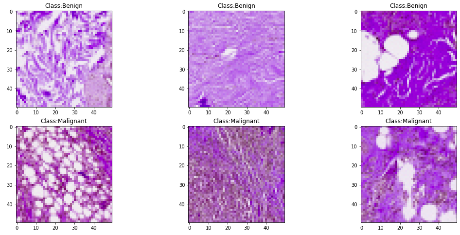
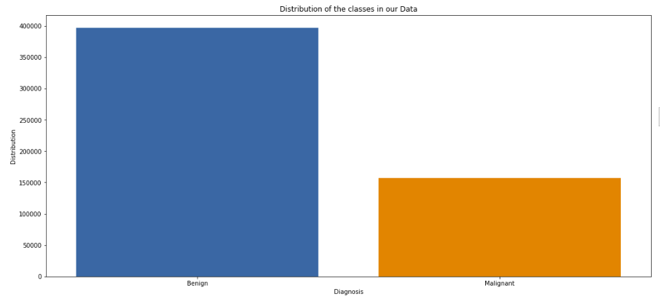
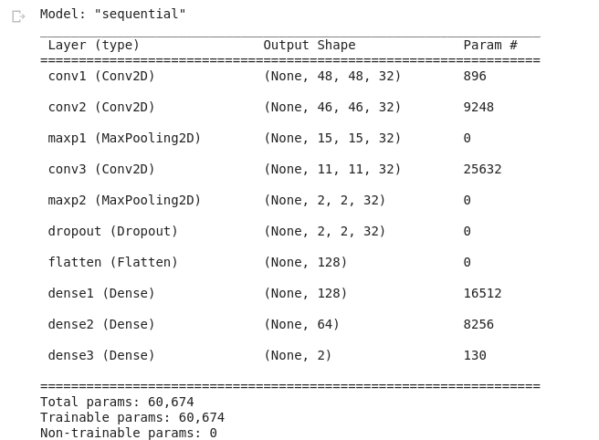
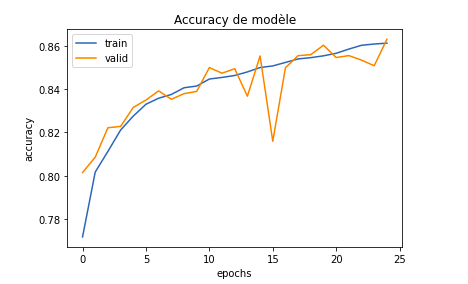
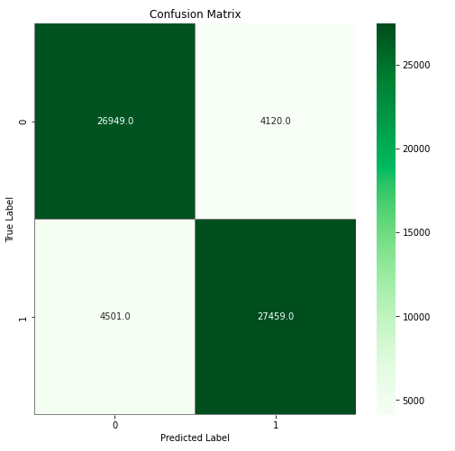
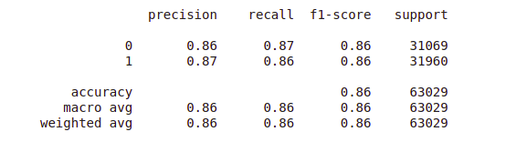

# Breast Cancer Classification

Breast Cancer Classification using CNN

## Data

The dataset can be downloaded from Kaggle [here](https://www.kaggle.com/paultimothymooney/breast-histopathology-images). This is a binary classification problem. I split the data as shown-

The original dataset consisted of 162 whole mount slide images of Breast Cancer (BCa) specimens scanned at 40x. From that, 277,524 patches of size 50 x 50 were extracted (198,738 IDC negative and 78,786 IDC positive). Each patch’s file name is of the format: uxXyYclassC.png — > example 10253idx5x1351y1101class0.png . Where u is the patient ID (10253idx5), X is the x-coordinate of where this patch was cropped from, Y is the y-coordinate of where this patch was cropped from, and C indicates the class where 0 is non-IDC and 1 is IDC
    

## Environment and tools

1. Jupyter Notebook
2. Numpy
3. Pandas
4. Matplotlib
5. Scikit-learn
6. TensorFlow
7. Kaggle
8. opencv

## Installation

`pip install numpy pandas  matplotlib scikit-learn tensorflow kaggle opencv-python `

`jupyter notebook`

### classification samples

### Classes Distribution

The number of samples used is 157572 for each class

## Model

## Results

### Loss/Accuracy vs Epoch

### Confusion Matrix

### Classification Report

The model is able to reach a test/validation accuracy of 86%, precision 86%, recall 0.87, f1 score of 0.86 and ROC-AUC as 0.93.

Made With ♥ by Hassan Abida | Data Science Student @ FSTG Marrakesh [LinkedIn](https://www.linkedin.com/in/hassan-abida/).
